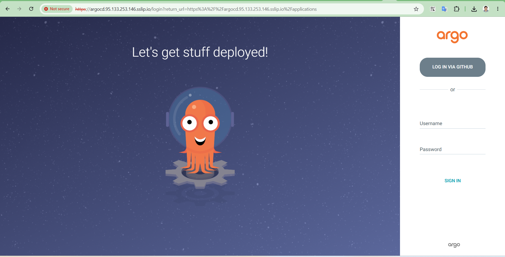
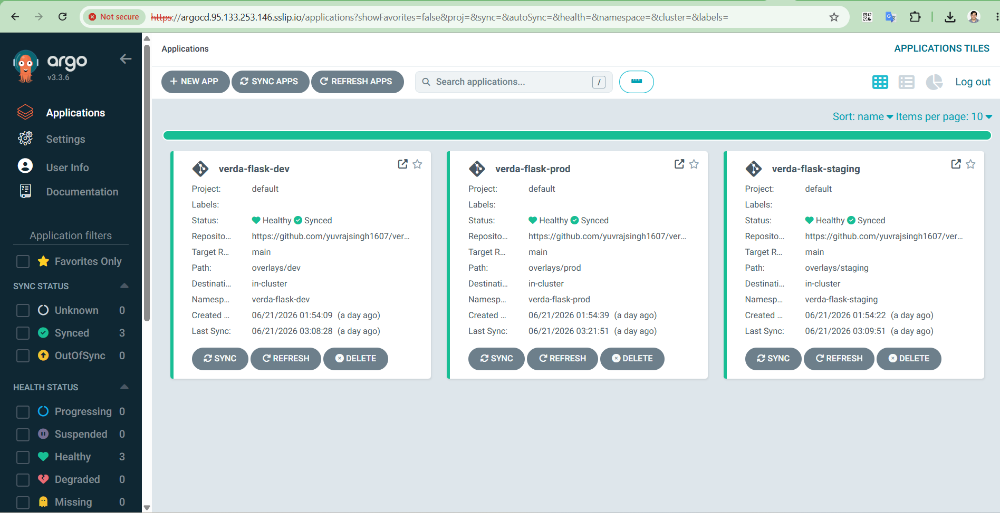
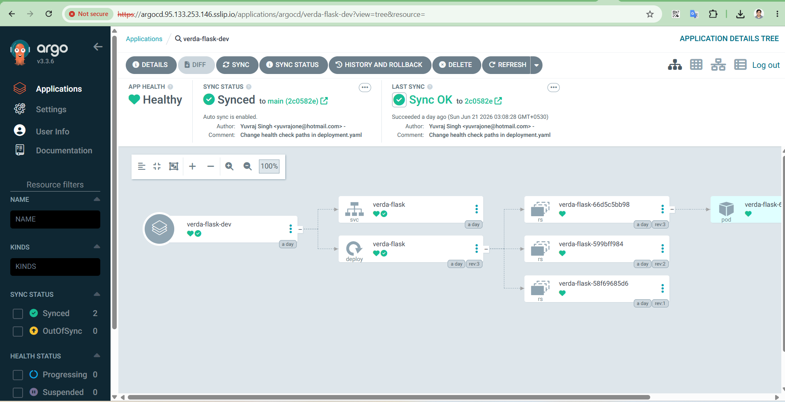
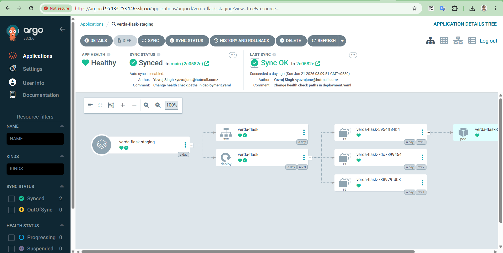
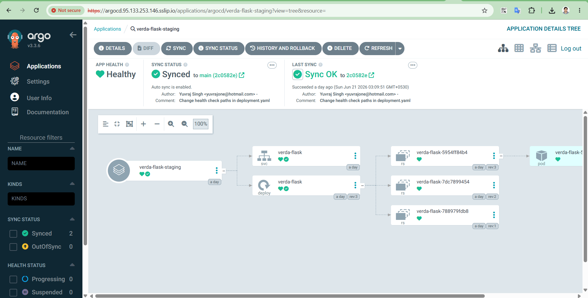

# Argo CD

**Install, SSO, GitOps Structure, and Promotion — Reference**

## 1. Overview

| Item | Value |
|---|---|
| Namespace | `argocd` |
| Hostname | `argocd.95.133.253.146.sslip.io` |
| Gateway node | `worker-2` (`95.133.253.146`) |
| TLS source | Self-bootstrapped CA (Issuer "argocd", backed by `argocd-ca-secret`) |
| SSO provider | GitHub OAuth via Dex |
| GitOps repo | https://github.com/yuvrajsingh1607/verda-flask-gitops |

## 2. Install

```bash
helm repo add argo https://argoproj.github.io/argo-helm
helm repo update
kubectl create namespace argocd

helm install argocd argo/argo-cd \
  --version 9.5.0 \
  --namespace argocd
```

Initial admin password:

```bash
kubectl -n argocd get secret argocd-initial-admin-secret \
  -o jsonpath='{.data.password}' | base64 -d; echo
```

## 3. Required Config Change: Insecure Mode

By default, `argocd-server` terminates its own TLS. Since the Cilium
Gateway also terminates TLS, routing post-termination plaintext to
`argocd-server`'s HTTPS listener fails. The fix is the same pattern used
for Rancher and Harbor: tell the backend app to speak plain HTTP, and
let the Gateway own TLS entirely.

```bash
kubectl patch configmap argocd-cmd-params-cm -n argocd --type merge \
  -p '{"data":{"server.insecure":"true"}}'
kubectl -n argocd rollout restart deployment argocd-server
kubectl -n argocd rollout status deployment argocd-server
```

## 4. TLS and Exposure: Cilium Gateway

Full manifest set in `argocd-gateway.yaml`. Argo CD needed its own
self-bootstrapped CA (unlike Rancher, which auto-creates one) — a 3-step
pattern repeated for Harbor and Prometheus/Grafana too: a `selfSigned`
root Issuer, a CA Certificate signed by it, and a real CA-type Issuer
backed by that CA's secret, which the leaf Certificate then references.

- **First attempted hostname/node:** `argocd.31.22.104.56.sslip.io` on
  `worker-3` — abandoned because `worker-3` was already committed to the
  Rancher Gateway, and one IP can't serve two LoadBalancer Services both
  wanting port 443.
- **Final hostname/node:** `argocd.95.133.253.146.sslip.io` on `worker-2`.
- **HTTPRoute backend port is 80** (matches the `server.insecure=true`
  change in Section 3).

## 5. SSO: GitHub OAuth via Dex

### 5.1 Register the GitHub OAuth App

| Field | Value |
|---|---|
| Authorization callback URL | `https://argocd.95.133.253.146.sslip.io/api/dex/callback` |

### 5.2 Store the client secret and configure Dex

```bash
kubectl -n argocd patch secret argocd-secret --type merge -p '{
  "stringData": {
    "dex.github.clientSecret": "<your-github-client-secret>"
  }
}'

kubectl -n argocd patch configmap argocd-cm --type merge -p '{
  "data": {
    "url": "https://argocd.95.133.253.146.sslip.io",
    "dex.config": "connectors:\n  - type: github\n    id: github\n    name: GitHub\n    config:\n      clientID: <client-id>\n      clientSecret: $dex.github.clientSecret\n"
  }
}'

kubectl -n argocd rollout restart deployment argocd-dex-server
kubectl -n argocd rollout restart deployment argocd-server
```

> **Both restarts are required:** Restarting only `argocd-dex-server` is
> not enough — `argocd-server` itself caches/reads this config at its
> own startup too. The symptom of restarting only Dex is:
> ```
> failed to query provider "": Get "/.well-known/openid-configuration":
> unsupported protocol scheme ""
> ```
> Restarting `argocd-server` resolves it.

### 5.3 RBAC: grant access to the GitHub-authenticated user

By default, an empty `policy.default` means any authenticated user —
including a successful GitHub login — gets zero permissions, not even
read access. The Applications list appears completely empty even though
`kubectl` shows them existing.

```bash
kubectl -n argocd patch configmap argocd-rbac-cm --type merge -p '{
  "data": { "policy.default": "role:readonly" }
}'
```

> **A subtlety on subject matching:** Matching a policy line by GitHub
> username (`g, <username>, role:admin`) does not work — Argo CD's RBAC
> matches against the OIDC token's actual `sub` claim, which for the
> GitHub connector is the **numeric GitHub user ID**, not the login name.
> The error message itself states the expected subject:
> `permission denied: applications, sync, default/<app>, sub: <numeric-id>`.
> Use that numeric ID directly:
> ```bash
> kubectl -n argocd patch configmap argocd-rbac-cm --type merge -p '{
>   "data": { "policy.csv": "g, <numeric-github-user-id>, role:admin" }
> }'
> ```

## 6. GitOps Structure and Promotion Thinking

The `verda-flask-gitops` repository uses a Kustomize base/overlay
structure: a single `base/` (Deployment, Service) and three `overlays/`
(dev, staging, prod), each only overriding the image tag, namespace, and
(for prod) replica count.

| Environment | Sync policy | Role in the pipeline |
|---|---|---|
| dev | automated (prune + selfHeal) | Fast feedback — every Git push deploys immediately |
| staging | automated (prune + selfHeal) | Pre-prod validation, same policy as dev |
| prod | no automated block at all | The actual promotion gate — requires an explicit, deliberate sync action |

Promoting a change to production is therefore a real, demonstrable act,
not just a description: edit the overlay's image tag in Git, commit,
then manually trigger the sync.

```bash
kubectl -n argocd patch application verda-flask-prod --type merge -p '{
  "operation": {
    "sync": { "revision": "HEAD" },
    "initiatedBy": { "username": "manual-promotion" }
  }
}'
```

> **Verified end-to-end:** All three environments (dev/staging/prod)
> were independently confirmed healthy and serving real traffic, each
> exposed under its own Cilium Gateway listener and hostname
> (`dev.`/`staging.`/`prod.verda-flask.95.133.253.88.sslip.io`, all
> sharing one Gateway on `master-2` via per-listener TLS and
> per-namespace HTTPRoutes).

## Login



## Applications



### Dev application



### Stagging application



### Prod application

