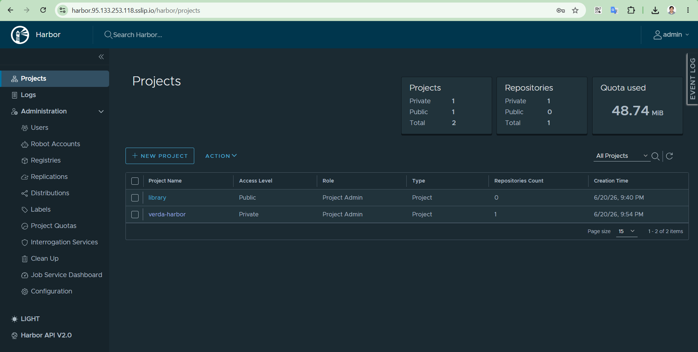
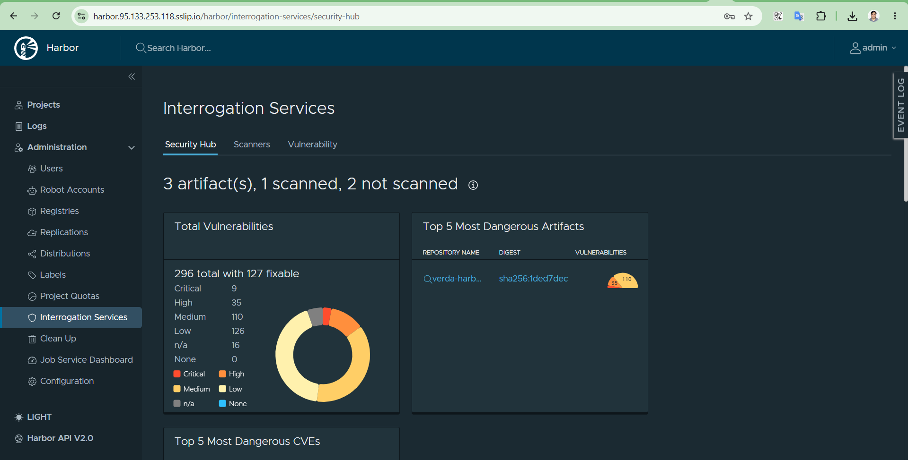
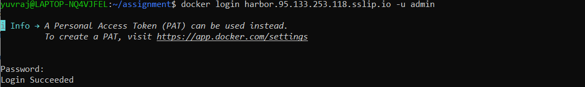
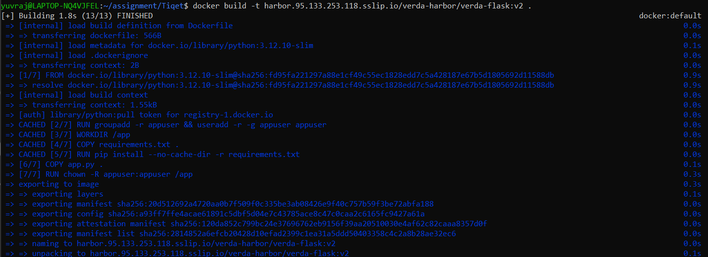
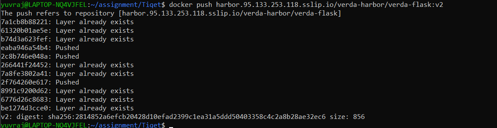
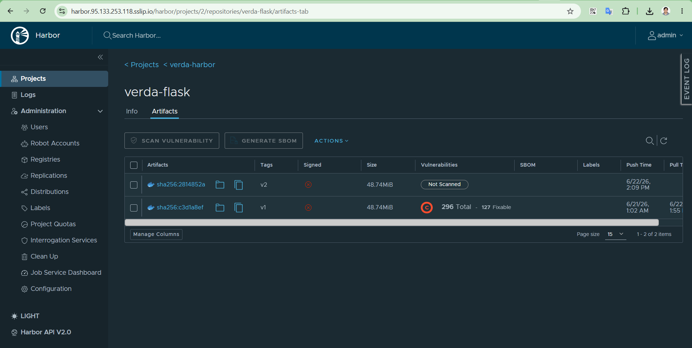

# Harbor

**Install, Storage, Image Flow, and the containerd CA-trust Saga — Reference**

## 1. Overview

| Item | Value |
|---|---|
| Namespace | `harbor` |
| Hostname | `harbor.95.133.253.118.sslip.io` |
| Gateway node | `worker-1` (`95.133.253.118`) |
| TLS source | Self-bootstrapped CA (Issuer "harbor", backed by `harbor-ca-secret`) |
| Storage backend | local-path-provisioner (PVCs) |
| Project / image | `verda-harbor` / `verda-flask:v1` |

## 2. Install

See `harbor-values.yaml` for the full Helm values used. Key settings:
`expose.type: clusterIP` with TLS disabled at Harbor's own layer (the
Cilium Gateway terminates TLS instead), and persistence enabled across
registry/database/redis/trivy.

```bash
helm repo add harbor https://helm.goharbor.io
helm repo update
kubectl create namespace harbor
helm install harbor harbor/harbor --namespace harbor -f harbor-values.yaml
```

## 3. Required Prerequisite: a StorageClass

Harbor's chart requests real PersistentVolumeClaims for its database,
registry, redis, and trivy components. The cluster had no StorageClass
at all, so every PVC sat `Pending` indefinitely — this surfaced as
`harbor-core` and `harbor-jobservice` crash-looping (they depend on the
database/redis being reachable, which themselves couldn't even
schedule).

```bash
kubectl apply -f https://raw.githubusercontent.com/rancher/local-path-provisioner/master/deploy/local-path-storage.yaml
kubectl patch storageclass local-path -p '{"metadata": {"annotations":{"storageclass.kubernetes.io/is-default-class":"true"}}}'
```

> **Result:** All 5 PVCs (database, registry, redis, trivy, jobservice)
> bound within moments once the provisioner existed; every Harbor pod
> settled to `Running` immediately afterward.

## 4. TLS and Exposure: Cilium Gateway

Full manifest set in `harbor-gateway.yaml` — the same
self-bootstrapped-CA pattern as Argo CD and Prometheus/Grafana. The
HTTPRoute backend targets the plain `harbor` Service (the nginx front
door) on port 80.

## 5. Image Flow: Build, Trust, Push

### 5.1 The actual problem: CA trust, at three different layers

Getting a self-built image from a developer's laptop into the cluster,
through this self-signed Harbor, required establishing trust at three
genuinely separate points — each with its own failure mode:

| Layer | What needed to trust the CA | Mechanism that worked |
|---|---|---|
| Docker Desktop (Windows/WSL) | The `docker push` client | Import the CA into Windows' own certificate store (`Cert:\LocalMachine\Root`), **NOT** Docker Desktop's internal BusyBox-based engine VM, which has no real cert-management tooling at all |
| System CA trust store | kubelet's image pull (CRI plugin) | `update-ca-certificates` after copying the CA into `/usr/local/share/ca-certificates/`, on every node |

### 5.2 Trusting the CA on Windows (Docker Desktop / WSL)

Docker Desktop's own engine VM (the `docker-desktop` WSL distro) is
BusyBox-based with no CA-management tooling — attempting to add the
cert there is a dead end. The actual fix is the Windows certificate
store, since Docker Desktop's TLS stack runs on the Windows host side:

```powershell
# In an Administrator PowerShell:
Import-Certificate -FilePath "C:\Users\<user>\harbor-ca.crt" -CertStoreLocation Cert:\LocalMachine\Root
```

Also tried and explicitly **not** recommended for anything beyond a
quick local test: Docker Desktop's `insecure-registries` setting. It
bypasses the registry's own TLS verification but does not cover Harbor's
separate token-auth service endpoint (`/service/token`), so push/pull
still failed with the same x509 error even with `insecure-registries`
configured.

### 5.4 Build and push

```bash
docker login harbor.95.133.253.118.sslip.io -u admin
docker build -t harbor.95.133.253.118.sslip.io/verda-harbor/verda-flask:v1 .
docker push harbor.95.133.253.118.sslip.io/verda-harbor/verda-flask:v1
```

## 6. Pulling the Image into the Cluster

### 6.1 imagePullSecrets — required for a private project

```bash
kubectl create secret docker-registry harbor-creds \
  --docker-server=harbor.95.133.253.118.sslip.io \
  --docker-username=admin \
  --docker-password='<password>' \
  --namespace=<target-namespace>   # repeat per namespace: dev, staging, prod
```

Reference it in the Deployment's pod spec:

```yaml
spec:
  template:
    spec:
      imagePullSecrets:
        - name: harbor-creds
```

## 7. Harbor Portal

Projects



Scanner



Docker login



Build



Push




