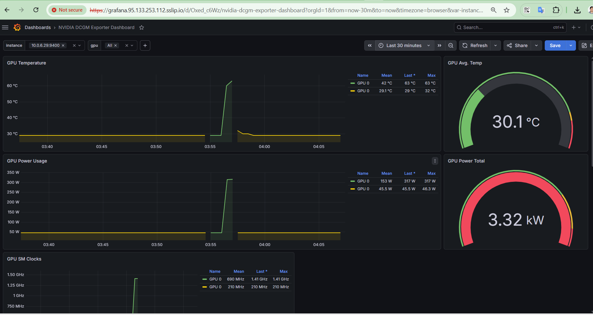
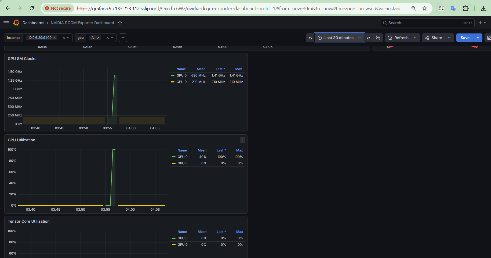

# Triggering a GPU Workload and Demonstrating GPU Scheduling

This document shows an end-to-end, verified example of running a real GPU
compute workload on a Kubernetes cluster with an NVIDIA GPU node
(`worker-gpu-1`, NVIDIA A100-SXM4-40GB), and confirms — using the
scheduler's own output, not just configuration — that the workload was
placed correctly and actually exercised the hardware.


 ### NVIDIA GPU Operator installation:

``` bash
helm repo add nvidia https://nvidia.github.io/gpu-operator

helm repo update

kubectl create namespace gpu-operator

helm install --wait gpu-operator \
  -n gpu-operator \
  nvidia/gpu-operator \
  --version=v26.3.2

kubectl apply -f dgcm-servicemonitor.yaml
``` 

## Prerequisites

- NVIDIA GPU Operator installed and healthy (drivers, container toolkit,
  device plugin, DCGM exporter all running on the GPU node)
- `kubectl get nodes` shows the GPU node as `Ready`
- `kubectl describe node worker-gpu-1` shows `nvidia.com/gpu: 1` under both
  `Capacity` and `Allocatable`

``` bash

kubectl get pods -n gpu-operator

NAME                                                          READY   STATUS      RESTARTS   AGE
gpu-feature-discovery-9b5k7                                   1/1     Running     0          4h6m
gpu-operator-566d545bf5-7wl48                                 1/1     Running     0          4h7m
gpu-operator-node-feature-discovery-gc-8fb8d5d8d-s2hhn        1/1     Running     0          4h7m
gpu-operator-node-feature-discovery-master-5bbc6d887b-nnx29   1/1     Running     0          4h7m
gpu-operator-node-feature-discovery-worker-6lg2b              1/1     Running     0          4h7m
gpu-operator-node-feature-discovery-worker-br5rv              1/1     Running     0          4h7m
gpu-operator-node-feature-discovery-worker-cjwbh              1/1     Running     0          4h7m
gpu-operator-node-feature-discovery-worker-fqvck              1/1     Running     0          4h7m
gpu-operator-node-feature-discovery-worker-gqkt9              1/1     Running     0          4h7m
gpu-operator-node-feature-discovery-worker-srkmz              1/1     Running     0          4h7m
gpu-operator-node-feature-discovery-worker-w8m9k              1/1     Running     0          4h7m
nvidia-container-toolkit-daemonset-5m7fx                      1/1     Running     0          4h6m
nvidia-cuda-validator-t2tgf                                   0/1     Completed   0          4h4m
nvidia-dcgm-exporter-czzjp                                    1/1     Running     0          4h6m
nvidia-device-plugin-daemonset-fgjgm                          1/1     Running     0          4h6m
nvidia-driver-daemonset-mbnqx                                 1/1     Running     0          4h7m
nvidia-mig-manager-2rz44                                      1/1     Running     0          4h4m
nvidia-operator-validator-9hpzb                               1/1     Running     0          4h6m
```

## 1. The Workload Manifest

[`gpu-burn`](https://github.com/wilicc/gpu-burn) is a purpose-built
multi-GPU CUDA stress test. It runs a real compute load, checks the
results for correctness (catching hardware errors, not just spinning the
chip), and reports live GFLOPS throughput.

```yaml
apiVersion: v1
kind: Pod
metadata:
  name: gpu-burn-test
  namespace: default
spec:
  restartPolicy: Never
  containers:
    - name: gpu-burn
      image: oguzpastirmaci/gpu-burn
      args: ["60"]            # run for 60 seconds
      resources:
        limits:
          nvidia.com/gpu: 1   # the actual GPU resource request
```

Apply it:

```bash
cat <<EOF | kubectl apply -f -
apiVersion: v1
kind: Pod
metadata:
  name: gpu-burn-test
  namespace: default
spec:
  restartPolicy: Never
  containers:
    - name: gpu-burn
      image: oguzpastirmaci/gpu-burn
      args: ["60"]
      resources:
        limits:
          nvidia.com/gpu: 1
EOF
```

**Output:**
```
pod/gpu-burn-test created
```

## 2. Watching the Workload Actually Run

```bash
kubectl logs -f gpu-burn-test
```

**Output:**
```
GPU 0: NVIDIA A100-SXM4-40GB (UUID: GPU-9c6bc079-0af2-acae-76e9-713696040cdf)
Burning for 60 seconds.
11.7%  proc'd: 4474 (17545 Gflop/s)   errors: 0   temps: 51 C
        Summary at:   Sun Jun 21 22:25:50 UTC 2026
25.0%  proc'd: 11185 (17548 Gflop/s)   errors: 0   temps: 54 C
        Summary at:   Sun Jun 21 22:25:58 UTC 2026
36.7%  proc'd: 20133 (17545 Gflop/s)   errors: 0   temps: 58 C
        Summary at:   Sun Jun 21 22:26:05 UTC 2026
48.3%  proc'd: 26844 (17548 Gflop/s)   errors: 0   temps: 59 C
        Summary at:   Sun Jun 21 22:26:12 UTC 2026
```

This confirms the workload is doing real, sustained compute — not just
detecting the GPU:

- **~17,500 GFLOP/s sustained** throughout the run
- **`errors: 0`** — gpu-burn cross-checks every result; zero errors means
  the hardware is computing correctly under load, not just busy
- **Temperature climbing 51 °C → 59 °C** as the run progresses — direct
  physical evidence of real thermal load, not a synthetic/mocked number

## 3. Confirming the Scheduler's Placement Decision

```bash
kubectl get pod gpu-burn-test -o wide
```

**Output (while running):**
```
NAME            READY   STATUS    RESTARTS   AGE    IP           NODE           NOMINATED NODE   READINESS GATES
gpu-burn-test   1/1     Running   0          2m8s   10.0.6.118   worker-gpu-1   <none>           <none>
```

**Output (after completion):**
```
NAME            READY   STATUS      RESTARTS   AGE     IP           NODE           NOMINATED NODE   READINESS GATES
gpu-burn-test   0/1     Completed   0          2m23s   10.0.6.118   worker-gpu-1   <none>           <none>
```

The pod was scheduled onto `worker-gpu-1` — the only node in the cluster
with a GPU device registered — and ran to completion cleanly (`Completed`,
`RESTARTS: 0`).

## 4. The Scheduler's Own Resource Accounting and Event Log

```bash
kubectl describe pod gpu-burn-test | grep -A8 "Limits:\|Events:"
```

**Output:**
```
    Limits:
      nvidia.com/gpu:  1
    Requests:
      nvidia.com/gpu:  1
    Environment:       <none>
    Mounts:
      /var/run/secrets/kubernetes.io/serviceaccount from kube-api-access-dqlpn (ro)
Conditions:
  Type                        Status
--
Events:
  Type    Reason     Age    From               Message
  ----    ------     ----   ----               -------
  Normal  Scheduled  3m     default-scheduler  Successfully assigned default/gpu-burn-test to worker-gpu-1
  Normal  Pulling    2m59s  kubelet            Pulling image "oguzpastirmaci/gpu-burn"
  Normal  Pulled     117s   kubelet            Successfully pulled image "oguzpastirmaci/gpu-burn" in 1m2.355s (1m2.355s including waiting). Image size: 1558680736 bytes.
  Normal  Created    117s   kubelet            Created container: gpu-burn
  Normal  Started    116s   kubelet            Started container gpu-burn
```

This is the definitive proof of scheduling, in the scheduler's own words:

> `Successfully assigned default/gpu-burn-test to worker-gpu-1`

The pod's `Limits`/`Requests` explicitly declared `nvidia.com/gpu: 1`, and
`default-scheduler` — the real, standard Kubernetes scheduler, not a mock
or simulation — found the one node in the cluster that could satisfy that
resource request and placed the pod there.

## 5. Correlating with GPU Monitoring

As Prometheus + Grafana with the DCGM exporter dashboard is set up, the GPU Utilization
and GPU Temperature panels for this exact time window
(`22:25:50`–`22:26:12 UTC`) will show a clear spike, visually confirming
the same load reported in the pod's own logs above.





## Summary

| Step | What it proves |
|---|---|
| Apply the manifest | A real Kubernetes resource request for `nvidia.com/gpu: 1` |
| `kubectl logs -f` | The GPU is actually computing — sustained GFLOPS, zero errors, rising temperature |
| `kubectl get pod -o wide` | The pod landed on `worker-gpu-1`, the only GPU-equipped node |
| `kubectl describe pod` | The scheduler's own event log: `Successfully assigned ... to worker-gpu-1` |

Together, these four steps show the complete chain from "a workload asked
for a GPU" to "the scheduler placed it correctly" to "the hardware
genuinely did the work" — not just a configuration that looks correct on
paper, but a verified, end-to-end result.
