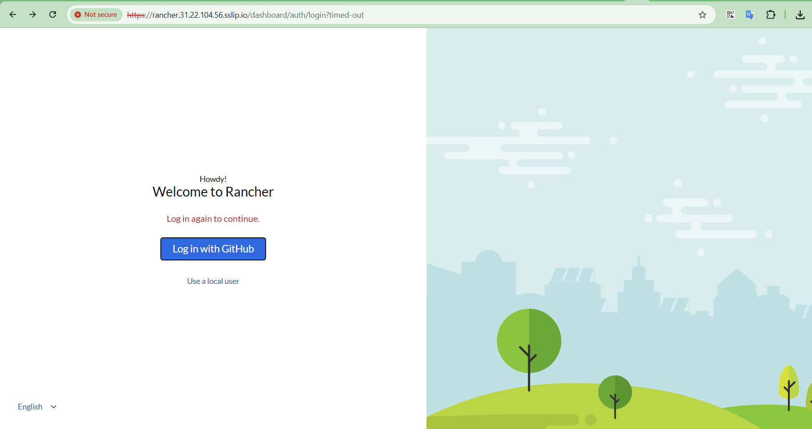
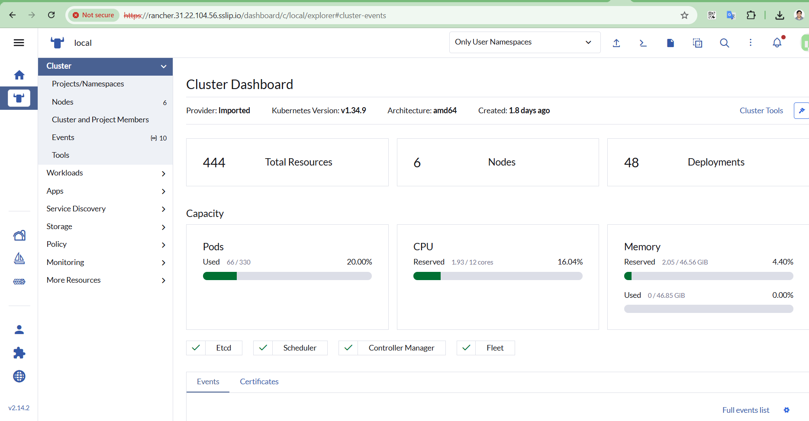
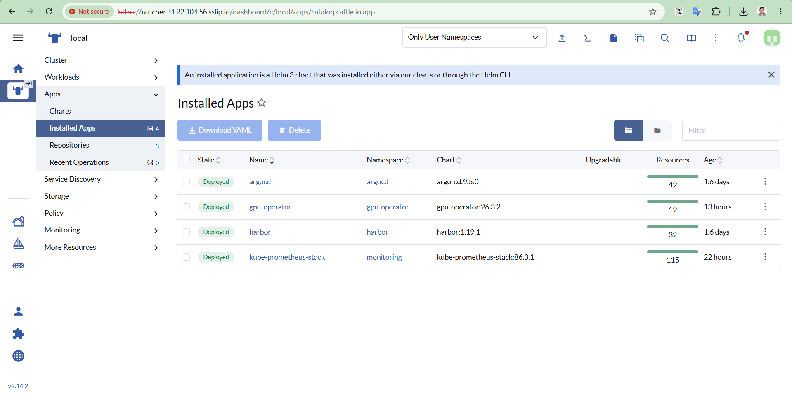
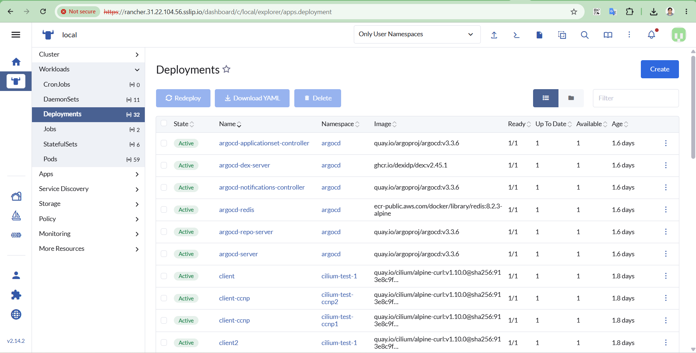

# Rancher

**Install, SSO, and Cilium Gateway Exposure — Reference**

## 1. Overview

Rancher Manager runs in-cluster (not via the original Docker-based
quick-start), installed via Helm into the `cattle-system` namespace,
behind cert-manager, and exposed through Cilium's Gateway API rather
than an Ingress controller.

| Item | Value |
|---|---|
| Namespace | `cattle-system` |
| Hostname | `rancher.31.22.104.56.sslip.io` |
| Gateway node | `worker-3` (`31.22.104.56`) |
| TLS source | Rancher's own auto-created self-signed CA Issuer, named "rancher" (`dynamiclistener-ca`) |
| SSO provider | GitHub OAuth |

## 2. Installation

Installed via the official Rancher Helm chart, with cert-manager as a
prerequisite (Rancher's chart creates its own Issuer automatically when
cert-manager is present).

```bash
helm repo add jetstack https://charts.jetstack.io
helm repo update
kubectl create namespace cert-manager
helm install cert-manager jetstack/cert-manager \
  --namespace cert-manager \
  --version v1.20.2 \
  --set crds.enabled=true

helm repo add rancher-stable https://releases.rancher.com/server-charts/stable
helm repo update
kubectl create namespace cattle-system

helm install rancher rancher-stable/rancher \
  --namespace cattle-system \
  --set hostname=95.133.253.81.sslip.io \
  --set bootstrapPassword=admin \
  --set replicas=3
```

> **Note on hostname:** The chart's `--set hostname` value here was the
> initial install-time hostname; the real, final external hostname (once
> exposed via the Cilium Gateway) is `rancher.31.22.104.56.sslip.io`.
> Rancher's `server-url` setting (Section 3) is what actually controls
> the hostname used for redirects/callbacks going forward — it must
> match the Gateway hostname, not the install-time value.

### 2.1 First-time login

```bash
kubectl get secret --namespace cattle-system bootstrap-secret \
  -o go-template='{{.data.bootstrapPassword|base64decode}}{{ "\n" }}'
```

Use this password at the hostname's `/dashboard/?setup=...` URL on first
login, then set a real admin password.


## 3. SSO: GitHub OAuth

### 3.1 Fix `server-url` first

Before configuring SSO, Rancher's `server-url` setting must point at the
real, externally reachable hostname — otherwise the OAuth redirect
target is wrong and the login flow fails with no clear error (it was
found set to the factory default `https://localhost:8443`).

```bash
kubectl patch settings.management.cattle.io server-url --type=merge \
  -p '{"value":"https://rancher.31.22.104.56.sslip.io"}'

kubectl get settings.management.cattle.io server-url -o jsonpath='{.value}'
```

### 3.2 Register a GitHub OAuth App

| Field | Value |
|---|---|
| Homepage URL | `https://rancher.31.22.104.56.sslip.io` |
| Authorization callback URL | `https://rancher.31.22.104.56.sslip.io/verify-auth` |

### 3.3 Enable it in Rancher

1. ☰ menu → **Users & Authentication** → **Auth Provider** → **GitHub**
2. Paste in the Client ID and Client Secret from the registered OAuth App
3. Click **Authenticate with GitHub** → choose access scope → **Enable**

> **Result:** Login screen shows "Log in with GitHub" alongside local
> admin login. Local admin is retained as a fallback.

## 4. Exposure: Cilium Gateway API

See `rancher-gateway.yaml` for the full Gateway/HTTPRoute/IP-pool/L2-policy
set (same pattern as `harbor-gateway.yaml`). Key points specific to
Rancher:

- **No separate CA bootstrap was needed** — Rancher's Helm chart
  auto-creates a self-signed Issuer named `rancher` the moment
  cert-manager is detected; the Gateway's leaf Certificate simply
  references that existing Issuer.
- **Backend port is 80, not 443** — routing plaintext
  (post-TLS-termination) traffic to Rancher's own HTTPS listener on 443
  produces a 400 "Client sent an HTTP request to an HTTPS server" error.
- **Pinned to `worker-3`** — chosen specifically because that node had
  already shown IPAM quirks (Section 3), making it a deliberate choice
  to keep experiments away from the masters.


## 5. Rancher Portal

Login using Github Authentication



Cluster details



Installed apps



Deployments


