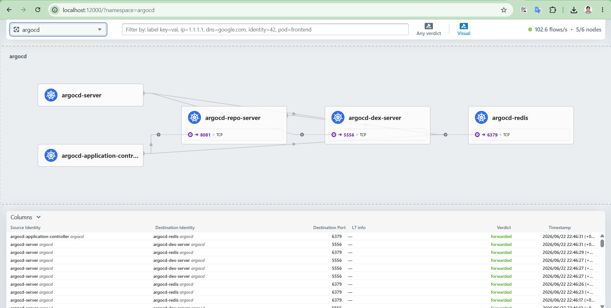

# Cilium

**Network Policy Approach and Observability (Hubble) — Reference**

## 1. Overview

Cilium is the cluster's CNI, installed during initial cluster bring-up
and used throughout for Service routing (kube-proxy-replacement),
Gateway API (every externally exposed service in this cluster goes
through a Cilium Gateway), and L2 Announcements (each Gateway's external
IP is ARP-announced from one specific node).

## 2. Network Policy Approach

Cilium's `CiliumNetworkPolicy` (CRD: `cilium.io/v2`) extends the
standard Kubernetes `NetworkPolicy` with L3/L4 and L7-aware rules,
identity-based (label) selectors, and DNS/FQDN-based egress rules —
capabilities the plain Kubernetes `NetworkPolicy` object doesn't have.
The general approach taken here:

- **Default posture is currently open** — no policies exist, so any pod
  can reach any other pod/Service. This is acceptable for a
  single-tenant lab cluster but is explicitly the first thing to change
  before any production use.
- **Recommended approach going forward:** default-deny per namespace,
  with explicit allow rules layered on top — each workload should only
  be reachable from the specific things that genuinely need to reach it
  (its own Gateway, Prometheus for scraping, and nothing else by
  default).
- **Identity-based selectors (`matchLabels`) are preferred over
  IP-based rules** wherever possible, since pod IPs are ephemeral but
  labels are stable — this is the same reasoning that drove the
  `CiliumLoadBalancerIPPool`/`L2AnnouncementPolicy` label-selector
  pattern used throughout the Gateway setups (see Rancher/Argo
  CD/Harbor/Prometheus reference docs).

## 3. Observability Approach: Hubble

Hubble is Cilium's built-in flow-observability layer, built on the same
eBPF data path Cilium already uses for packet forwarding — it provides
real-time visibility into actual traffic (source, destination, verdict,
L7 detail where enabled) without needing a separate sidecar or proxy per
pod.

| Layer | Status | What it gives you |
|---|---|---|
| Per-node Hubble server | Enabled by default (`enable-hubble: true`) since initial Cilium install | Local flow visibility on a single node, queryable via that node's own Cilium agent |
| Hubble Relay | Enabled later via Helm upgrade | Cluster-wide flow aggregation — a single pane of glass across all nodes |
| Hubble UI | Enabled alongside Relay | Visual service-dependency graph and live flow list, in-browser |

```bash
helm upgrade cilium cilium/cilium --version 1.19.5 \
  --namespace kube-system --reuse-values \
  --set hubble.relay.enabled=true \
  --set hubble.ui.enabled=true \
  --set hubble.tls.enabled=true
```

Access (via SSH tunnel, no separate Gateway was set up for this):

```bash
ssh -L 12000:localhost:12000 root@95.133.253.81
# then, on master-1: kubectl -n kube-system port-forward svc/hubble-ui 12000:80
# browser: http://localhost:12000/?namespace=<namespace-to-inspect>
```


## 4. Demonstration: Example 1 Deployed and Verified

Example 1 (Harbor database isolation, Section 2.1) was deployed against
the live cluster and verified end-to-end — not just applied and assumed
to work, but confirmed at the Cilium datapath level and tested against
both allowed and blocked traffic.

### 4.1 Confirm labels match before applying

The policy's `matchLabels` were written from Harbor's typical labeling
convention. Before applying, the actual live labels were checked to
avoid a silent mismatch that would make the policy look applied while
enforcing nothing:

```bash
kubectl -n harbor get pods --show-labels | grep -E "core|jobservice|registry|database"
```

Confirmed: every Harbor pod carries both `app=harbor` and
`component=<core|jobservice|registry|database>` — an exact match to
the policy's selectors.

### 4.2 Apply

```bash
kubectl apply -f cilium-network-policies.yaml   # or apply just the first policy in the file
```

```
ciliumnetworkpolicy.cilium.io/harbor-database-restrict created
```

```bash
kubectl get ciliumnetworkpolicy -n harbor
# NAME                       AGE   VALID
# harbor-database-restrict   32s   True
```

`VALID: True` confirms Cilium's validation webhook accepted the policy
as well-formed — but this alone does not prove it's being *enforced*.

### 4.3 Confirm real enforcement at the Cilium datapath

```bash
kubectl -n harbor get pod harbor-database-0 -o jsonpath='{.spec.nodeName}'
# worker-1

WORKER1_CILIUM=$(kubectl -n kube-system get pods -l k8s-app=cilium -o wide | grep worker-1 | awk '{print $1}')
kubectl -n kube-system exec $WORKER1_CILIUM -- cilium-dbg endpoint list 2>/dev/null | grep -i database
```

```
3286       Enabled            Disabled          35428      k8s:app.kubernetes.io/component=database   10.0.5.236   ready
                                                            k8s:component=database
```

> The first status column is **ingress** enforcement, the second is
> **egress**. `Ingress: Enabled` confirms Cilium has loaded this policy
> into its BPF datapath on `worker-1` and is actively enforcing it on
> this specific endpoint — every other endpoint checked earlier in this
> engagement showed `Disabled` here, since no policies existed before
> this one. `Egress: Disabled` is correct too: the policy only defines
> an `ingress` block, so egress traffic from the database pod remains
> unrestricted, exactly as written.

### 4.4 Prove the allow-list still works

```bash
kubectl -n harbor logs harbor-core-7994fb4db-kvcpf --tail=20 | grep -iE "database|postgres|error"
```

```
2026-06-20T19:18:19Z [ERROR] [.../basic_auth.go:72]...: failed to authenticate
user:admin, error:Failed to authenticate user, due to error 'Invalid credentials'
```

The only error present is an unrelated failed login attempt (invalid
credentials on a `docker login` call) — no database-connectivity errors
appear. Combined with `harbor-core` showing `1/1 Running` with no new
restarts after the policy was applied, this confirms the explicitly
allowed path (`core` → `database`) continues to function normally.

### 4.5 Prove the policy actually blocks unauthorized traffic

A throwaway pod with **no** `app=harbor`/`component=*` labels was used
to simulate traffic from something that should now be denied:

```bash
kubectl run policy-test --image=busybox -n harbor --restart=Never -- sleep 3600
kubectl -n harbor get pod policy-test
# policy-test   1/1   Running   0   23s

kubectl -n harbor exec policy-test -- nc -zv -w 3 harbor-database 5432
```

```
nc: harbor-database (10.99.16.240:5432): Connection timed out
command terminated with exit code 1
```

> **Result:** the connection attempt timed out — before this policy
> existed, every endpoint in the cluster showed `Ingress: Disabled`
> (fully open), so this exact connection would have succeeded instantly.
> This is genuine, verified enforcement: a pod without the allowed
> labels cannot reach the database, while pods with the allowed labels
> (Section 6.4) are unaffected.

### 4.6 Cleanup

```bash
kubectl -n harbor delete pod policy-test
```

### 4.7 Summary

| Check | Result |
|---|---|
| Policy object created | `VALID: True` |
| Datapath enforcement | `Ingress: Enabled` on the database endpoint (was `Disabled` cluster-wide before) |
| Allowed traffic (`core` → `database`) | Unaffected — no new errors, pod remains healthy |
| Unauthorized traffic (unlabeled pod → `database`) | Blocked — connection timed out |
