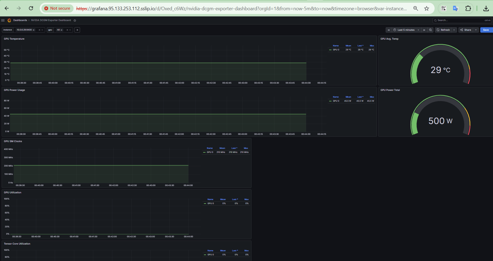
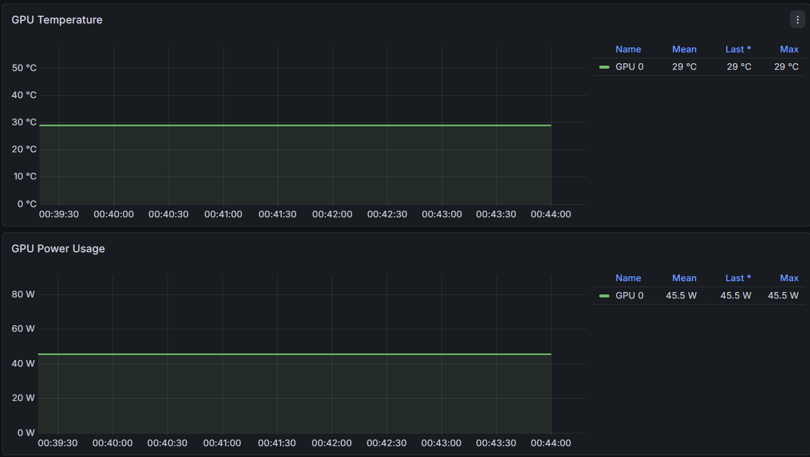
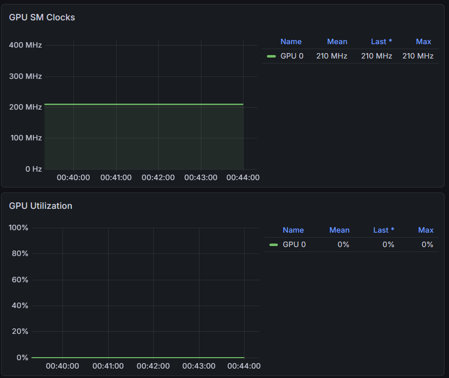
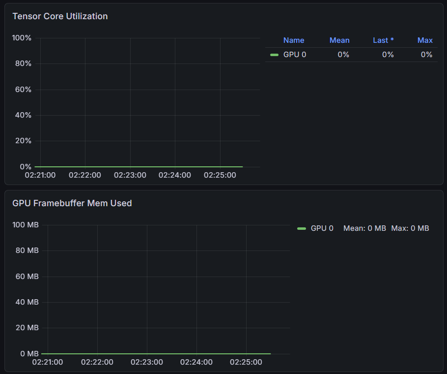
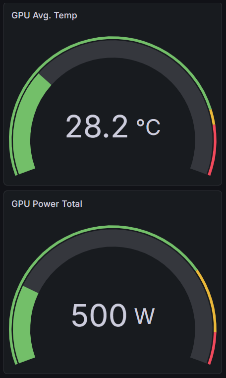
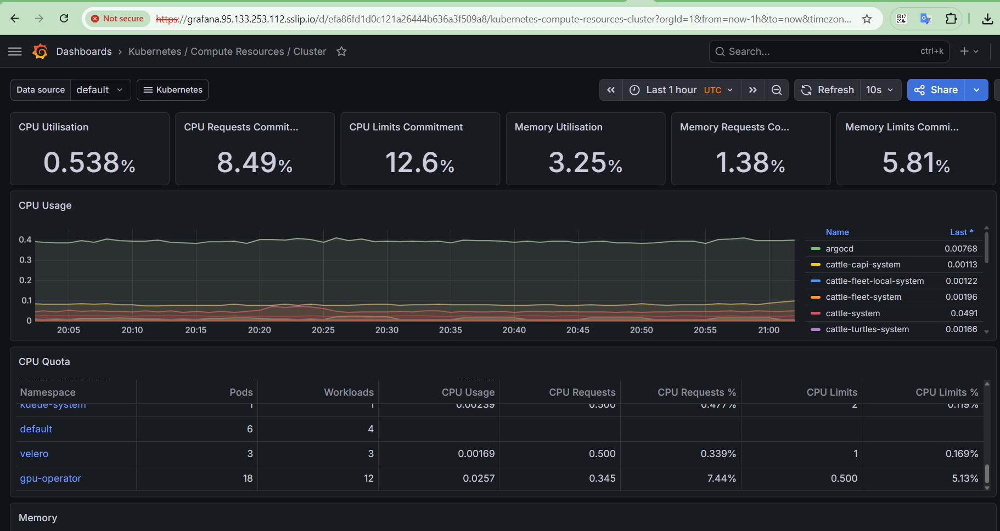
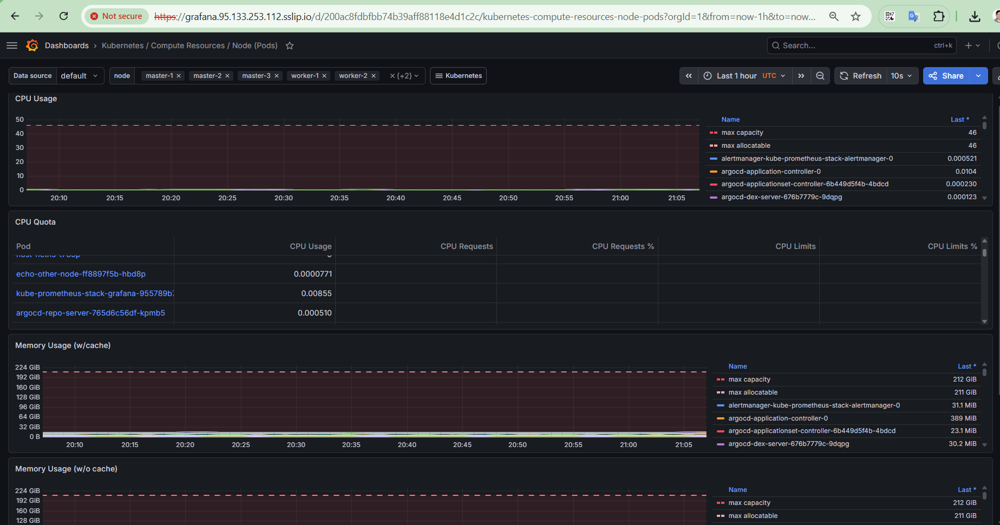
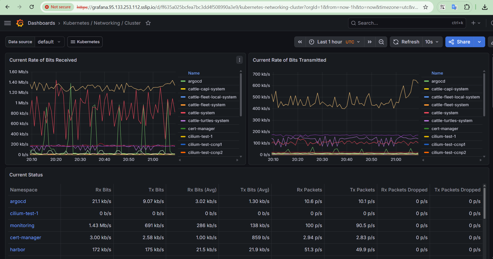
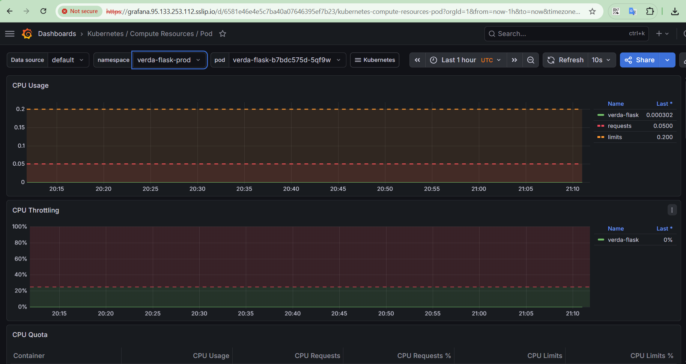
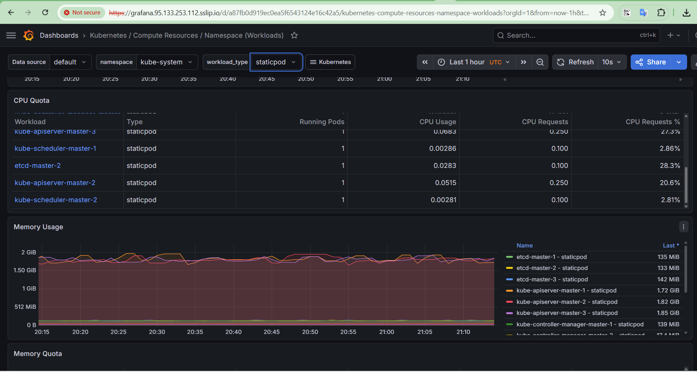

# Monitoring


## Table of Contents

-   [Overview](#overview)
-   [Installation](#installation)
-   [Grafana Exposure](#grafana-exposure)
-   [GPU Monitoring](#gpu-monitoring)
-   [Cluster and Nodes Health Dashboard](#cluster-dashboard)
-   [Production Alerting Strategy](#production-alerting-strategy)
- [Summary](#summary)

------------------------------------------------------------------------

# Overview

> **Reference Guide**\
> Kubernetes monitoring stack is created using Prometheus, Grafana,
> Alertmanager, Cilium Gateway API, and NVIDIA DCGM GPU
> monitoring. 
  -----------------------------------------------------------------------
  Item                                Value
  ----------------------------------- -----------------------------------
  Namespace                           `monitoring`

  Helm Chart                          `kube-prometheus-stack 86.3.1`

  Grafana Host                        `grafana.95.133.253.112.sslip.io`

  Gateway Node                        `master-3 (95.133.253.112)`

  Retention                           `15 days`

  Storage                             `Prometheus 20Gi, Alertmanager 2Gi,
                                      Grafana 5Gi (local-path)`
  

------------------------------------------------------------------------

# Installation

Prometheus kube-prometheus-stack is used to deploy monitoring solution. Installation steps are given below:

``` bash
helm repo add prometheus-community https://prometheus-community.github.io/helm-charts

helm repo update

kubectl create namespace monitoring

helm install kube-prometheus-stack prometheus-community/kube-prometheus-stack \
  --version 86.3.1 \
  --namespace monitoring \
  -f monitoring-values.yaml

kubectl apply -f grafana-gateway.yaml
```

### Result

-   All components started successfully.
-   All PVCs bound on first deployment.
-   Node Exporter DaemonSet scheduled on all six nodes.

------------------------------------------------------------------------

# Grafana Exposure

Grafana is exposed through the **Cilium Gateway API**.

-   Manifest: `grafana-gateway.yaml`
-   Backend Service: `kube-prometheus-stack-grafana`
-   Backend Port: **80**
-   TLS uses the same self-bootstrapped CA approach as Argo CD and
    Harbor.

-----------------------------------------------------------------------


# GPU Monitoring

## NVIDIA Dashboard

The dashboard (ID 12239) was imported which now displays live A100 GPU metrics.










------------------------------------------------------------------------

# Cluster and Nodes Health Dashboard

These are the dashboards related with nodes, pods, network and cluster resources:

## Cluster Health


## Nodes Health


## Network utilization


## pods statistics


## Workloads utiliztions


------------------------------------------------------------------------

# Production Alerting Strategy

We should configure below Alerts and set threshold based on the application or components business need and priorities:

## Cluster Health

-   Node NotReady
-   etcd latency
-   etcd leader changes
-   API Server availability
-   Certificate expiry

## Workloads

-   CrashLoopBackOff
-   ImagePullBackOff
-   Deployment replica mismatch
-   Pending PVCs

## Resource Saturation

-   CPU \> 80%
-   Memory \> 80%
-   PVC usage \> 85%

## Platform-Specific

-   Argo CD OutOfSync
-   Cilium agent failures
-   Certificate renewal failures

## Suggested Severity

  Severity   Examples
  ---------- ----------------------------------------------------------
  Critical   Node down, etcd quorum loss, API unavailable
  Warning    Resource saturation, pod crash loops, certificate expiry
  Info       Security scan findings, GitOps sync drift

------------------------------------------------------------------------

# Summary

It serves as a reference deployment for Kubernetes cluster
observability and alerting strategy for a production system.

-   Prometheus
-   Grafana
-   Alerting Strategy
-   Kubernetes resources monitoring
-   NVIDIA GPU monitoring
-   Cilium Gateway API exposure


