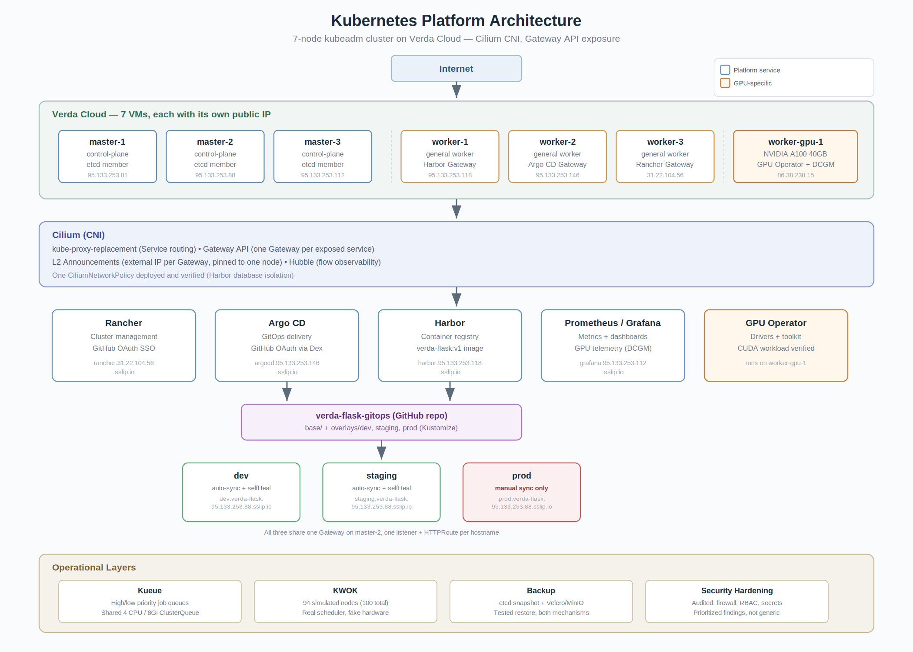

# Summary Report

**A 7-Node Kubernetes Platform on Verda Cloud: Build, Architecture, and Lessons Learned**

---

## 1. What You Built

A self-managed Kubernetes platform, built from bare VMs up, covering the
full lifecycle of a real platform-engineering stack — not just a single
tool, but how a cluster management layer, a GitOps pipeline, a container
registry, observability, batch scheduling, GPU compute, and backup all
fit together and depend on each other.

**Cluster foundation**
- 7 nodes on Verda Cloud: 3 control-plane, 3 general-purpose workers, 1
  GPU worker (NVIDIA A100 40GB), built with `kubeadm` directly (not a
  packaged distribution)
- Cilium as the CNI, handling Service routing (`kube-proxy-replacement`),
  Gateway API, and L2 Announcements for external IP exposure
- A standalone scripted install process (10 numbered scripts) covering
  OS prep, container runtime, Kubernetes packages, control-plane init,
  CNI install, node joins, and firewall rules

**Platform services, each exposed via its own Cilium Gateway and TLS certificate**
- **Rancher Manager** — cluster management UI, GitHub OAuth SSO
- **Argo CD** — GitOps continuous delivery, GitHub OAuth SSO via Dex, a
  real dev/staging/prod promotion pipeline backed by a public GitHub repo
- **Harbor** — a private container registry, with a real image actually
  built, pushed, and deployed from it
- **Prometheus + Grafana** (kube-prometheus-stack) — cluster and
  application metrics, with GPU telemetry integrated
- **Hubble + Hubble UI** — Cilium's network observability layer

**Workload-management add-ons**
- **Kueue** — priority-based batch job queueing, demonstrated with real
  resource contention and preemption
- **KWOK** — simulated the cluster up to 100 nodes to demonstrate
  scheduler behavior at scale, without provisioning real infrastructure
- **NVIDIA GPU Operator** — drivers, container toolkit, and device
  plugin for the A100 node, with a genuine CUDA workload run and verified

**Operational layers**
- **Cilium network policy** — one policy deployed and verified at the
  packet level; a documented approach for the rest
- **Backup** — both an etcd snapshot (cluster-state) and a working
  Velero install (namespace-scoped, application-aware), each tested with
  a real restore, not just configured
- **Security hardening** — an honest, specific audit of this cluster's
  actual current gaps

---

## 2. Architecture

Each platform service follows the same exposure pattern: a self-bootstrapped
or auto-created TLS CA, a Cilium `Gateway` terminating TLS, an `HTTPRoute`
forwarding plaintext to the backend, a `CiliumLoadBalancerIPPool` claiming
one node's existing public IP, and a `CiliumL2AnnouncementPolicy` pinning
that IP's ARP announcement to one specific node — six services, six
distinct external IPs, six independent TLS chains, one consistent pattern.

---

## 3. What Worked / What Did Not

### Worked cleanly, first attempt
- Cluster bring-up itself (kubeadm init, Cilium install, node joins)
- Prometheus/Grafana install, once `local-path-provisioner` existed
- KWOK node simulation and scheduler demonstration
- Kueue's actual admission/preemption behavior, once both PriorityClass
  types existed
- The GPU workload and scheduling proof (once the node itself had joined)
- The Cilium network policy demonstration (label verification first,
  then a clean apply-and-prove cycle)

### Worked, but only after real debugging
- **Rancher**: a stale Cilium IPAM allocation caused CrashLoopBackOff;
  fixed by force-deleting the affected pod
- **Harbor**: getting a self-built image through a self-signed registry
  required fixing CA trust at three independent layers (Docker Desktop
  on Windows, containerd's `certs.d` — which didn't actually work despite
  being correctly configured — and finally the OS-level trust store)
- **Argo CD SSO**: required restarting *two* separate Deployments (Dex
  and the server itself) and discovering that Argo CD's RBAC matches a
  numeric GitHub user ID, not a username

---

## 4. Security and Operational Considerations

The full audit lives in `Security/Security_Hardening.md`; the highest-
priority points:

- **A real Harbor password was exposed in plaintext** during live
  debugging — confirmed, needs rotation before this environment is
  trusted further.
- **Every cluster-internal firewall rule allows from "Anywhere"** —
  the API server, etcd, and kubelet are all reachable from the public
  internet today, with no network-layer restriction at all. Only one
  port (Hubble's `4244`) was ever correctly scoped to specific peer IPs.
- **Cilium network policy is open by default** across the entire
  cluster, with exactly one exception (the Harbor database isolation
  policy demonstrated and verified). Any pod can currently reach any
  other pod or Service.
- **No ResourceQuotas, LimitRanges, or Pod Security Standards** exist on
  any namespace — nothing prevents a single workload from consuming the
  whole cluster's resources or running with excessive privileges.
- **Four independent, untracked self-signed CAs** (Rancher, Argo CD,
  Harbor, Grafana) — fine for a lab, but each is a separate trust root
  with no central inventory of expiry dates or rotation procedures.
- **No audit logging** is configured on the API server — there is
  currently no record of who did what, beyond each tool's own logs.
- **Backups exist but are stored only on the cluster's own
  infrastructure** — the etcd snapshot sits on `master-1`'s local disk;
  Velero's MinIO backend is `emptyDir`-backed. Neither has left the
  cluster.

Operationally, the cluster has also demonstrated real resilience: the
3-master control plane tolerated individual node restarts without
losing quorum, and the same root-cause-then-fix pattern (verify the
actual state, don't assume the documented behavior matches reality) was
what resolved every non-trivial issue encountered — most notably the
Harbor CA-trust chain and the Hubble Relay debugging.

---

## 5. What Would Be Improved With More Time

1. **Move Harbor's registry storage to real object storage (S3/GCS).**
   This single change converts "must back up a PersistentVolume" into
   "already durable by the storage layer" and removes the
   `local-path-provisioner` dependency for the one component where
   losing data would actually hurt.

2. **Ship backups off-cluster.** Point Velero at genuine external object
   storage instead of a self-hosted, `emptyDir`-backed MinIO, and
   regularly copy etcd snapshots off `master-1` rather than leaving them
   on the node that produced them.

3. **Default-deny network policy, cluster-wide.** One policy is
   deployed and proven; the same pattern should extend to every
   namespace holding real data (Argo CD, Rancher, the verda-flask
   environments), not just Harbor's database.

4. **Replace the four self-signed CAs with a real internal PKI** (or
   public certificates, if these services get real DNS names instead of
   `sslip.io` addresses) — and maintain a single inventory of what
   trusts what, rather than four independently-documented trust roots.

5. **Add the Cilium `k8sServiceHost` override proactively**, not
   reactively. It was added only after the GPU node's join failed; it
   should be standard configuration for any `kube-proxy`-free cluster
   from the start, since the next node join — GPU or otherwise — would
   hit the identical gap without it.

6. **Scope every firewall rule to actual peer node IPs.** The pattern
   already exists (it's exactly how the Hubble `4244` fix was done) —
   it just needs applying retroactively to every other port currently
   open to the entire internet.

7. **Add ResourceQuotas and Pod Security Standards** to every namespace,
   starting with `baseline` enforcement and explicit exemptions for
   workloads (like the GPU Operator's driver DaemonSets) that
   legitimately need elevated host access.

8. **Build a small CI step that validates manifests before they reach
   Argo CD** — every YAML in this engagement was hand-applied and
   manually verified; a real pipeline would lint and dry-run-apply
   manifests in CI before they ever reach a cluster, catching the kind
   of label/port-name mismatches (the DCGM ServiceMonitor's `gpu-metrics`
   vs `"9400"` issue, for example) before they cause a live debugging
   session.
